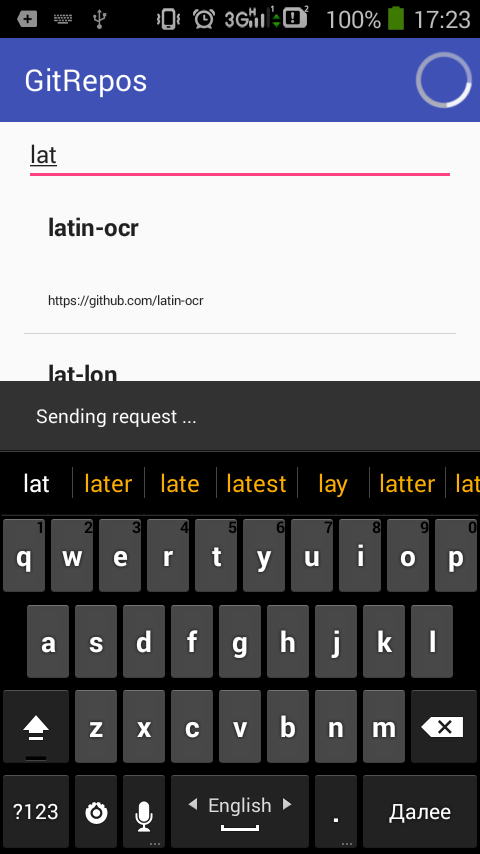
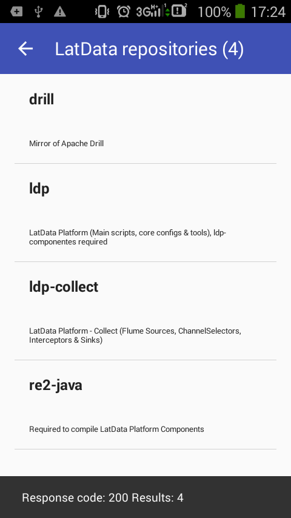

# GitRepos

- экран поиска организации
- поиск стартует после 3-го символа (обрабатываю только первую пачку результатов- до 30)
- экран списка репозитариев
- сохранение результатов последнего поиска в базу данных
- обработка поворота экрана
- информ.сообщения в Snackbar + индикатор ProgressBar

Использовал  одно Activity, EditText, RecyclerView + Adapter+кастомный DividerItemDecoration. c управлениеи UI элементами вручную.
Для запросов к API GitHub - Retrofit2 + OkHttpClien+кастомный Interceptor.
Для работы с базой -  ContentProvider+SQlite

